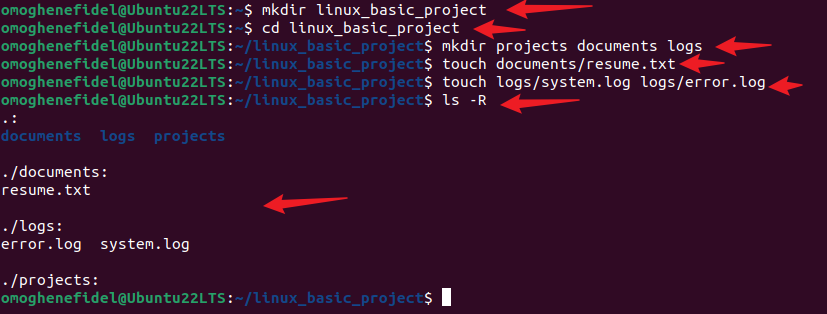
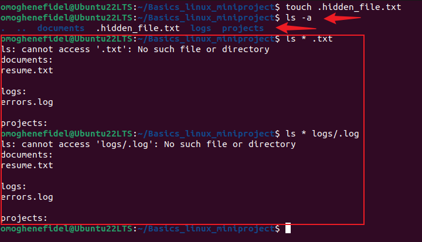
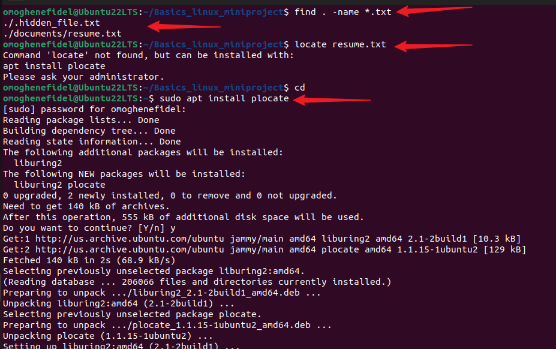
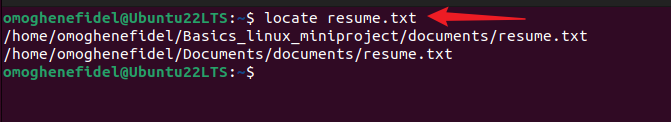

# 🐧 Linux Basics Mini Project: Explore & Organize Your Linux Environment

## 📌 Objective
This mini project focuses on fundamental Linux file and directory operations. It helps you learn how to navigate, create, manage, and find files and directories through practical command-line tasks.

## Step 1: Creating Directories and Files

mkdir projects documents logs
touch documents/resume.txt
touch logs/system.log logs/error.log

##  Step 2: Navigation Practice

cd 
pwd
cd ..
cd logs
pwd

## Step 3: Viewing & Manipulating Files

echo "This is my resume." > documents/resume.txt
cat documents/resume.txt
mv logs/error.log logs/errors.log
rm logs/system.log

## Step 4: Hidden Files and Wildcards

touch .hidden_file.txt
ls -a
ls *.txt
ls logs/*.log

## Step 5: Finding Files

find . -name "*.txt"
locate resume.txt

##  Summary of Commands Used

 `mkdir`, `cd`, `pwd`, `ls`, `touch`, `rm`, `mv`
 `cat`, `echo`, `find`, `locate`, wildcards `*`, `ls -a`

##  Conclusion

This project helped solidify my understanding of Linux file system navigation and basic file/directory operations. Through hands-on tasks, I became more confident in using the terminal to explore and manage Linux environments effectively.

# Below are screenshots of the project workflow:

